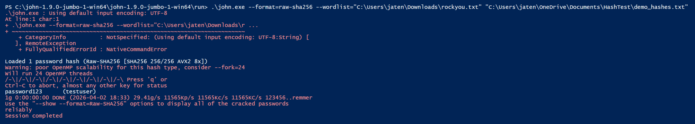
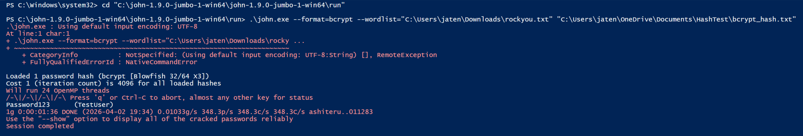

# Security Audit Report: Secure Payroll System

**Auditor:** Jessica Tennant  
**Date:** April 4, 2026  
**Repository:** https://github.com/jtennant324/Secure-Payroll-System

---

## Overview

This document is a self-directed security audit of the Secure Payroll System, a Python-based application built to demonstrate authentication and role-based access control. The purpose of this audit is to identify vulnerabilities in the original implementation, provide evidence of exploitation, and document the remediation steps taken.

---

## Findings Summary

| # | Finding | Severity | Status |
|---|---------|----------|--------|
| 1 | Weak password hashing — SHA-256 without salting | Critical | Remediated |
| 2 | No account lockout policy | High | Documented |
| 3 | No multi-factor authentication | High | Documented |
| 4 | No password complexity requirements | Medium | Documented |
| 5 | Password expiration policy | Informational | Documented |

---

## Finding 1: Weak Password Hashing

### Background
The original implementation of this application stored passwords in plain text. SHA-256 hashing was later added as a security improvement. However, this introduced a secondary vulnerability — hashing without salting — which is the subject of this finding.

### Vulnerability
SHA-256 is a cryptographic hash function, not a password hashing algorithm. Without salting, identical passwords produce identical hashes. This makes the system vulnerable to rainbow table attacks, where a precomputed list of hashes can be used to reverse engineer passwords without brute forcing them individually.

### Evidence
John the Ripper, an industry standard password auditing tool, was used to demonstrate this vulnerability. Using the rockyou.txt wordlist against a SHA-256 hashed password:



**Result:** Password cracked in 0 seconds at 11,565,000 attempts per second.

### Remediation
Password hashing was upgraded from SHA-256 to bcrypt with salting. Bcrypt is designed specifically for password storage and includes a built-in work factor that intentionally slows computation, making brute force attacks impractical.

The same attack was run against the bcrypt implementation:



**Result:** 1 minute 36 seconds at 348 attempts per second — and that is with a weak, commonly known password. A strong password would take years.

### Commit Reference
[View the remediation commit](https://github.com/jtennant324/Secure-Payroll-System/commits/main)

---

## Finding 2: No Account Lockout Policy

### Vulnerability
The current implementation allows unlimited login attempts with no lockout or delay mechanism. This leaves the system open to brute force attacks, where an attacker can repeatedly guess passwords without consequence.

### Evidence
The login function accepts unlimited failed attempts with no restriction:
```python
while True:
    user_id = input("Enter your User ID: ").strip()
    if user_id not in user_data:
        print("Error: User ID not found. Please try again.\n")
        continue

    password = input("Enter your Password: ").strip()
    if not bcrypt.checkpw(password.encode(), user_data[user_id]["password"].encode()):
        print("Error: Incorrect password. Please try again.\n")
        continue
```

### Recommendation
Implement an account lockout policy that tracks failed login attempts and temporarily locks the account after a defined threshold. Industry standard per NIST 800-63B is to lock the account after a maximum of 100 failed attempts, though stricter thresholds such as 5-10 attempts are common in practice.

---

## Finding 3: No Multi-Factor Authentication

### Vulnerability
The system relies solely on a username and password for authentication. If credentials are compromised through phishing, a data breach, or the brute force attack described in Finding 2, there is no secondary verification mechanism to prevent unauthorized access.

### Recommendation
Implement multi-factor authentication (MFA) as a second layer of verification beyond the password. Common implementations include time-based one-time passwords (TOTP) via an authenticator app, or email and SMS verification codes. This ensures that a compromised password alone is not sufficient to gain access to the system.

Per NIST 800-63B, MFA is strongly recommended for any system handling sensitive data such as payroll information.

---

## Finding 4: No Password Complexity Requirements

### Vulnerability
The system accepts any password regardless of length or complexity. A user could set their password to a single character, making it trivially easy to crack regardless of the hashing algorithm used. Strong hashing like bcrypt only protects against attacks on the stored hash — it cannot compensate for a weak password choice.

### Recommendation
Enforce a minimum password complexity policy at the point of account creation. Recommended requirements per NIST 800-63B:

- Minimum 8 characters in length
- Support for all printable ASCII characters including spaces
- Screen new passwords against a list of known compromised passwords such as rockyou.txt
- Do not require special characters or periodic rotation as these have been shown to encourage weaker password choices

Note: NIST specifically recommends **against** mandatory special characters and arbitrary expiration schedules, as research shows these requirements lead users to make predictable substitutions such as "Password1!" which are easy to crack despite meeting complexity rules.

---

## Finding 5: Password Expiration Policy

### Vulnerability
The system has no password expiration or rotation policy. While this is a lower severity finding, it is worth addressing from a policy standpoint.

### Recommendation
Contrary to traditional security guidance, NIST 800-63B now recommends **against** mandatory periodic password expiration on a fixed schedule. Research has shown that forced rotation leads users to make predictable changes such as incrementing a number at the end of their password, which weakens overall security.

Password changes should instead be required only when there is evidence of compromise, such as a detected breach or suspicious login activity. This approach maintains security without encouraging poor password habits.

**Note:** While NIST 800-63B recommends against mandatory rotation, organizations in regulated industries such as healthcare must adhere to additional compliance frameworks including HIPAA and DEA requirements, which may mandate periodic password changes. Security policy should always defer to the most restrictive applicable regulation.

---

## Conclusion

This audit identified five security findings ranging from critical to informational. The most severe finding — weak password hashing without salting — has been fully remediated through the implementation of bcrypt. The remaining findings represent recommendations for a production hardening roadmap and reflect industry standards per NIST 800-63B.

This project demonstrates a security-first development mindset, including the ability to identify vulnerabilities in existing code, provide evidence of exploitation using industry standard tools, and implement and document effective remediation.